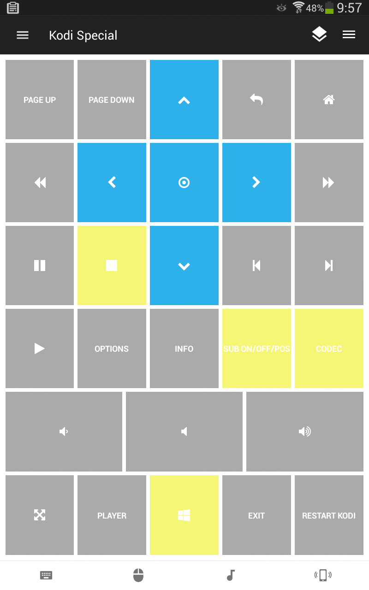

# Unified Remote Control for Kodi
I made my own customized **Unified Remote** for Kodi on Windows.

All the yellow buttons have double functionality depending on "tap" or "onhold", see description below.

Download here:https://github.com/dobbelina/Unified-Remote-Kodi/releases/download/V.1/Unified_Remote_V.1.zip

# Double Functionality
Button | Ontap | Onhold
--- |  --- | ---
 | Stop | Mark Watched
 | Enable/Disable subtitle | Subtitle position
 | Codec info 1 | Codec info 2
 | Windows key | Focus Kodi

## Screenshot

## Support
Developed and maintained by **Unified Remote**  
https://www.unifiedremote.com/help

