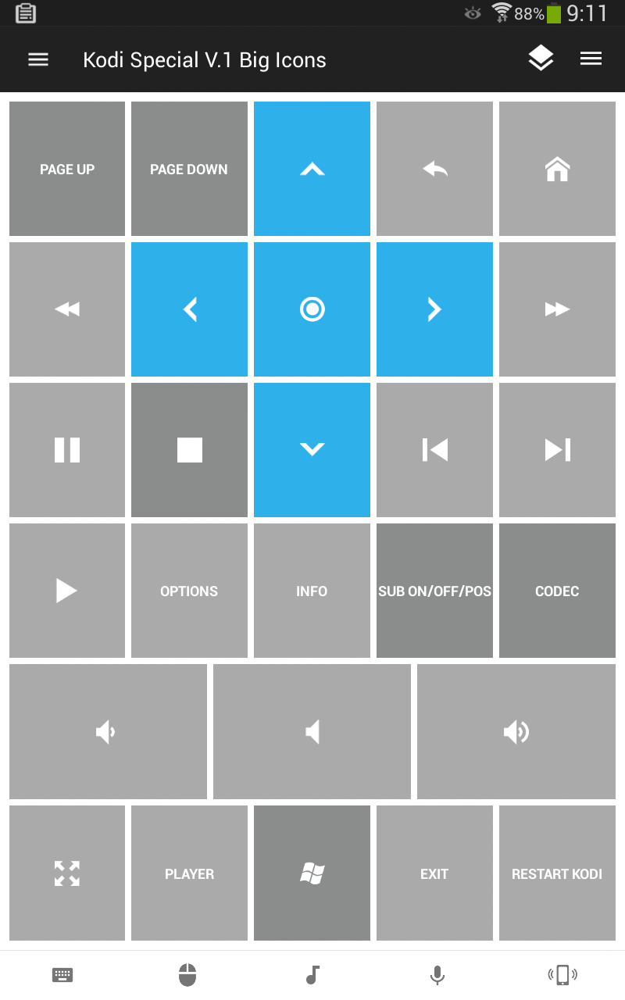

# Unified Remote Control for Kodi
I made my own customized **Unified Remote** control for Kodi on Windows.

All the yellow buttons have double functionality depending on "tap" or "onhold", see description below.

Download here:https://github.com/dobbelina/Unified-Remote-Control-Kodi/releases/download/V.1/Unified_Remote_V.1.zip

# Double Functionality
Button | Ontap | Onhold
--- |  --- | ---
 | 
Stop
 | 
Mark Watched

 | 
Enable/Disable subtitle
 | 
Subtitle position

 | 
Codec info 1
 | 
Codec info 2

 | 
Windows key
 | 
Focus Kodi

## Screenshot

## Support
Developed and maintained by **Unified Remote**  
https://www.unifiedremote.com/help

